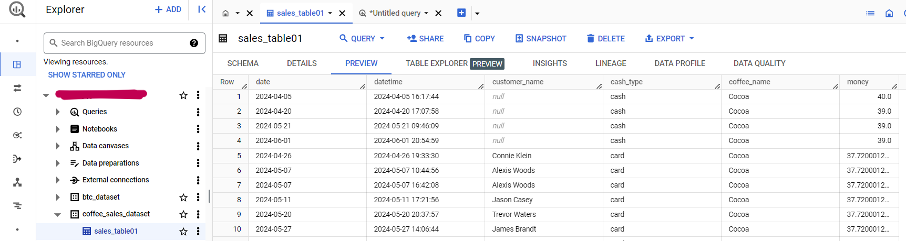

<h1> coffee_sales_pipeline </h1> 

    
  Sales Data Pipeline DAG

<h3> Create Cloud Composer (Airflow) and then set up the environment </h3>
<h3> Create dataset and table in BigQuery </h3>
<h3> Adding the Storage Object Admin role to the Cloud SQL service account </h3> 

    

<h3> Upload the Airflow DAG file to the DAGS folder </h3> 

  <pre><code> gsutil cp coffee_sales_dag.py [GCS_BUCKET]/dags </code></pre>

<h2> Result </h2> 

    
  data has been successfully loaded into BigQuery(Data warehouse)   
    
  query data

