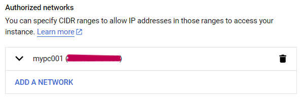
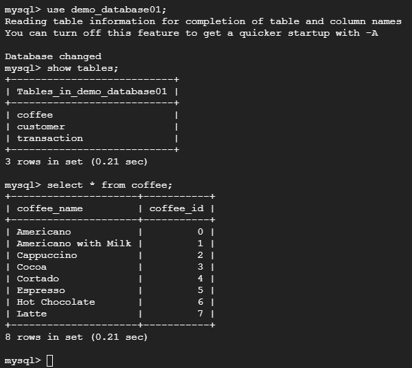
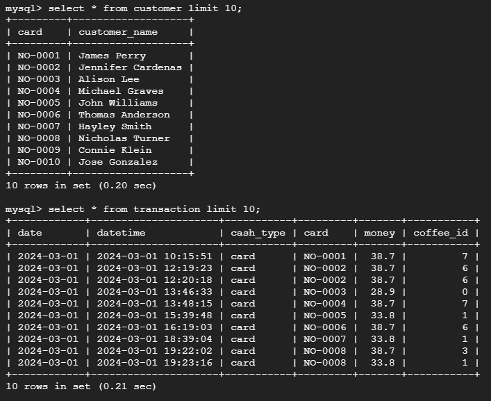

# Cloud SQL
```bash
gcloud sql connect your_Instance_ID --user=root --quiet
```

```sql
CREATE DATABASE demo_database01;
```

```sql
SHOW DATABASES;
```

```sql
USE demo_database01;
```

create table in database
```sql
CREATE TABLE Dummy_01 (personID INT PRIMARY KEY AUTO_INCREMENT , name VARCHAR(50) , day DATE , value FLOAT);
```

```sql
SHOW TABLES;
```

```sql
DESCRIBE Dummy_01;
```

## Check your public IP address and allow it to access the Cloud SQL instance
```bash
curl https://checkip.amazonaws.com/
```
#### connections->networking->add a network
 <br>

## Steps of data preprocessing
Preparing data for insertion into a database involves several important steps, including splitting the data, creating new variables from the existing data to enhance its usefulness, and performing data cleansing to ensure accuracy and consistency.
## Result 
As a result, we have 3 tables in the database: the transaction table, the customer table, and the coffee table. <br>
 <br>
 <br>
