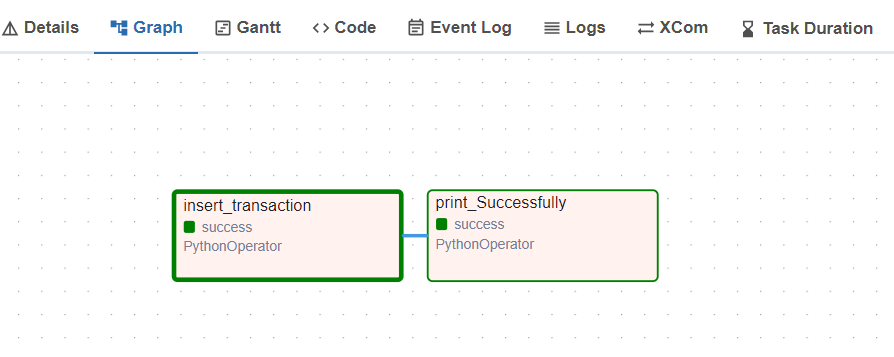
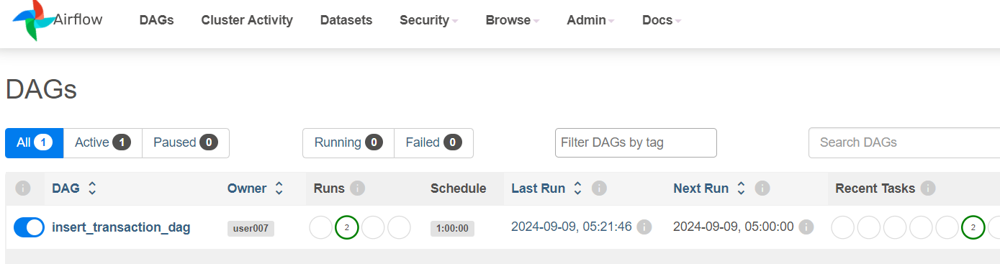
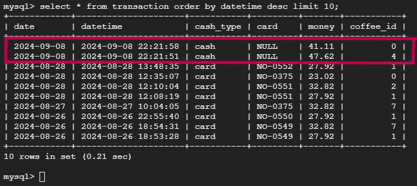

# Airflow schedule for inserting data into the database
 <br>
 <br>
dag (The time is GMT+7) <br>
 <br>
New data has been inserted into the database successfully (UTC time) <br><br><br>

#### Built docker image to install libraries from a requirements.txt 
```bash
docker build -t apache/airflow:2.10.1 . 
```

#### Initialize the database and create a user
```bash
docker compose up airflow-init
```

#### Start all services
```bash
docker compose up
```

#### Stop , delete containers , delete volumes with database data and download images
```bash
docker compose down --volumes --rmi all
```
